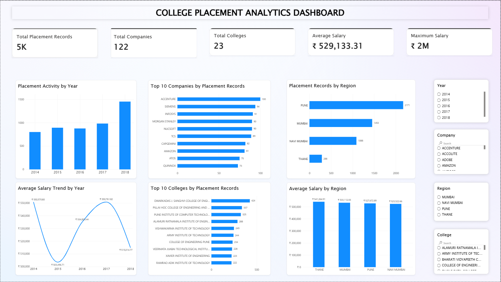

# 📊 College Placement Analytics Dashboard

An interactive **Power BI Dashboard** designed to analyze college placement activity, recruiter participation, college-wise performance, regional placement trends, and salary patterns.

---
## 🖥️ Dashboard Preview



## 🎯 Project Objective

The **College Placement Analytics Dashboard** helps institutions analyze placement data through interactive Power BI visualizations.

### Key Objectives

- 📈 Analyze placement activity across different years
- 🏢 Identify companies with the highest placement records
- 🎓 Compare placement performance across colleges
- 🌎 Compare placement activity across different regions
- 💰 Analyze salary trends across years and regions
- 📊 Support data-driven placement planning and decision-making

---

## 🖥️ Dashboard Preview

> Add your dashboard screenshot inside the `screenshots` folder and update the filename below.


---

## 📌 Dashboard KPIs

| KPI | Value |
|---|---:|
| 📋 Total Placement Records | **5K** |
| 🏢 Total Companies | **122** |
| 🎓 Total Colleges | **23** |
| 💰 Average Salary | **₹529,133.31** |
| 💎 Maximum Salary | **₹2M** |

---

## 📊 Dashboard Visualizations

The dashboard contains the following interactive visualizations:

### 1. 📈 Placement Activity by Year
Shows the number of placement records across different years.

### 2. 🏢 Top 10 Companies by Placement Records
Identifies companies with the highest number of placement records.

### 3. 🌎 Placement Records by Region
Compares placement activity across different regions.

### 4. 💰 Average Salary Trend by Year
Displays how average salary changes over different years.

### 5. 🎓 Top 10 Colleges by Placement Records
Highlights colleges with the highest placement activity.

### 6. 📊 Average Salary by Region
Compares average salary across different regions.

### 7. 🔎 Interactive Filters
Users can filter the dashboard using:

- Year
- Company
- Region
- College

---

## 🛠️ Technology Stack

| Technology | Purpose |
|---|---|
| **Power BI Desktop** | Dashboard development & visualization |
| **Power Query** | Data cleaning & transformation |
| **DAX** | Measures & KPI calculations |
| **CSV** | Data source |

---

## 📂 Dataset Information

The dataset contains college placement records covering:

- Companies
- Colleges
- Regions
- Years
- Salary information

### Dataset Details

| Field | Details |
|---|---|
| Key Fields | Company, College, Region, Year, Salary |
| Years Covered | 2014–2018 |
| Companies | 122 |
| Colleges | 23 |
| Placement Records | Approximately 5K |

---

## 🔍 Key Insights

Using the dashboard, users can:

- Identify companies with high placement activity
- Compare placement performance between colleges
- Compare placement records across regions
- Track placement activity year by year
- Analyze average salary trends
- Compare salary performance across regions
- Perform focused analysis using interactive slicers

---

## ⚙️ Data Preparation

The dataset was prepared using **Power Query** before creating the dashboard.

### Data Workflow

```text
CSV Dataset
     ↓
Power Query
     ↓
Data Cleaning
     ↓
Data Transformation
     ↓
DAX Measures
     ↓
Power BI Visualizations
     ↓
Interactive Dashboard
